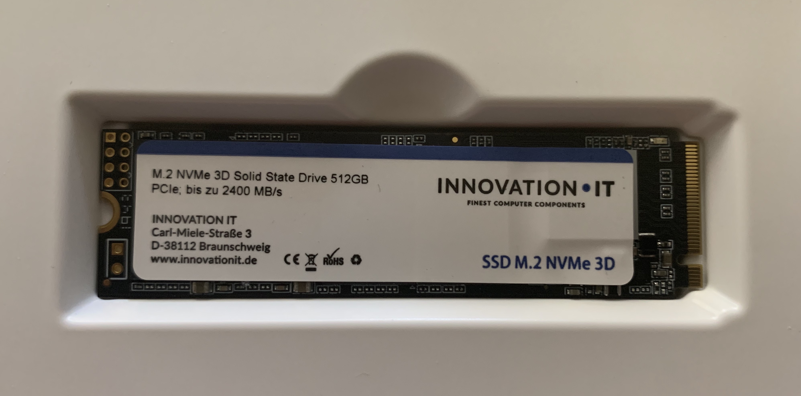
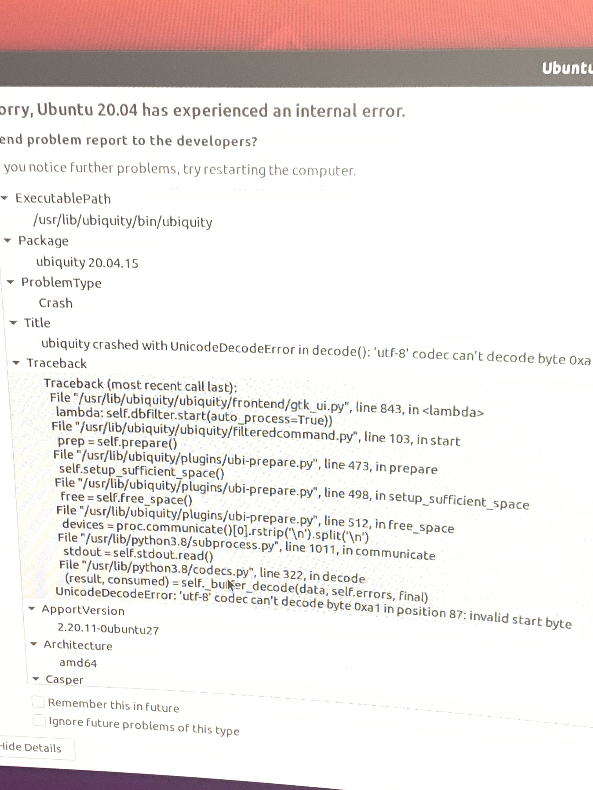
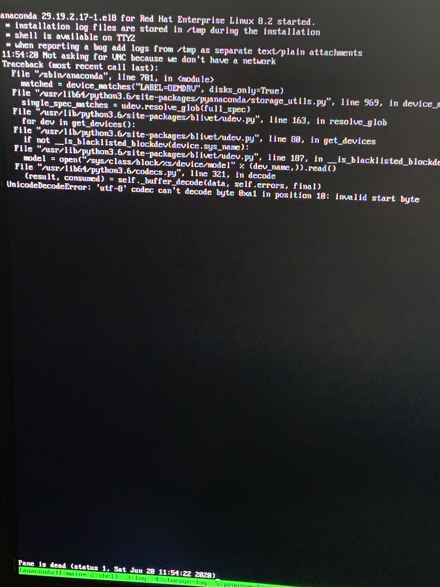

# Innovation IT python unicode decode
Innovation IT NVMe firmware has an issue in combination with python unicode decode.



# NVMe-cli
```bash
nvme list
Node             SN                   Model                                    Namespace Usage                      Format           FW Rev  
---------------- -------------------- ---------------------------------------- --------- -------------------------- ---------------- --------
/dev/nvme0n1     AA000000000000000131 INNOVATION��IT                           1         512,11  GB / 512,11  GB    512   B +  0 B   S0614B0G
```
As you can see, there are two signs of multibyte char with defect unicode output.

# fdisk
```bash
fdisk --l /dev/nvme0n1
Disk /dev/nvme0n1: 476,96 GiB, 512110190592 bytes, 1000215216 sectors
Disk model: INNOVATION��IT                          
Units: sectors of 1 * 512 = 512 bytes
Sector size (logical/physical): 512 bytes / 512 bytes
I/O size (minimum/optimal): 512 bytes / 512 bytes
Disklabel type: gpt
Disk identifier: 03C9D6B2-0E03-419E-B1F4-E70B7062B1EF

Device           Start        End   Sectors   Size Type
/dev/nvme0n1p1    2048    1050623   1048576   512M EFI System
/dev/nvme0n1p2 1050624 1000212479 999161856 476,4G Linux filesystem
```

# Block device
```bash
cat /sys/class/block/nvme0n1/device/model
INNOVATION��IT
```

# Example

## Run python example
This is a minimum example for the overall exception. Please edit your device, if needed.
```bash
python3 read_model.py
Traceback (most recent call last):
  File "read_model.py", line 34, in <module>
    print(f.read())
  File "/usr/lib/python3.8/codecs.py", line 322, in decode
    (result, consumed) = self._buffer_decode(data, self.errors, final)
UnicodeDecodeError: 'utf-8' codec can't decode byte 0xa1 in position 10: invalid start byte
```

## Fixed python example for this special case
This minimum example is based on above example and ignores decoding errors.
```bash
python3 read_model_quick_code_fix.py
INNOVATIONIT
```

# Result
- Linux systems like Ubuntu or RHEL, use a graphical installer and except because of this unicode sign.
- You are not able to install a system, only without installer for Ubuntu. I was not able to install RHEL in any case.
- The company behind Innovation IT products needs to update thier firmware and remove these unicode sign from model to work probably and even more correct.
- If you plan to buy a system with these NVMe, only do so if you not want to use linux as the host system.

# Installer Exceptions


