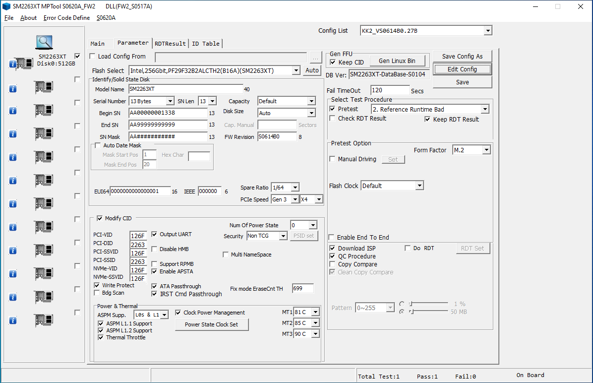

# Innovation IT python unicode decode
Innovation IT NVMe firmware has an issue in combination with python unicode decode.


# NVMe-cli
```bash
nvme list
Node             SN                   Model                                    Namespace Usage                      Format           FW Rev  
---------------- -------------------- ---------------------------------------- --------- -------------------------- ---------------- --------
/dev/nvme0n1     AA000000000000000131 INNOVATION��IT                           1         512,11  GB / 512,11  GB    512   B +  0 B   S0614B0G
```
As you can see, there are two signs of multibyte char with defect unicode output.

# fdisk
```bash
fdisk --l /dev/nvme0n1
Disk /dev/nvme0n1: 476,96 GiB, 512110190592 bytes, 1000215216 sectors
Disk model: INNOVATION��IT                          
Units: sectors of 1 * 512 = 512 bytes
Sector size (logical/physical): 512 bytes / 512 bytes
I/O size (minimum/optimal): 512 bytes / 512 bytes
Disklabel type: gpt
Disk identifier: 03C9D6B2-0E03-419E-B1F4-E70B7062B1EF

Device           Start        End   Sectors   Size Type
/dev/nvme0n1p1    2048    1050623   1048576   512M EFI System
/dev/nvme0n1p2 1050624 1000212479 999161856 476,4G Linux filesystem
```

# Block device
```bash
cat /sys/class/block/nvme0n1/device/model
INNOVATION��IT
```

# Example

## Run python example
This is a minimum example for the overall exception. Please edit your device, if needed.
```bash
python3 read_model.py
Traceback (most recent call last):
  File "read_model.py", line 34, in <module>
    print(f.read())
  File "/usr/lib/python3.8/codecs.py", line 322, in decode
    (result, consumed) = self._buffer_decode(data, self.errors, final)
UnicodeDecodeError: 'utf-8' codec can't decode byte 0xa1 in position 10: invalid start byte
```

## Fixed python example for this special case
This minimum example is based on above example and ignores decoding errors.
```bash
python3 read_model_quick_code_fix.py
INNOVATIONIT
```

# Result
- Linux systems like Ubuntu or RHEL, use a graphical installer and except because of this unicode sign.
- You are not able to install a system, only without installer for Ubuntu. I was not able to install RHEL in any case.
- The company behind Innovation IT products needs to update thier firmware and remove these unicode sign from model to work probably and even more correct.
- If you plan to buy a system with these NVMe, only do so if you not want to use linux as the host system.

# Installer Exceptions


# Reported bugs

https://bugzilla.redhat.com/show_bug.cgi?id=1849326

# Mitigation

Fortunately, for some unknown reason, one is able to find the manufacturer tool for the SSD's controller `SM2263XT`
on the internet. That means that we can simply change the name to something less broken ourselves.

**Warning** Reflashing the firmware parameters of the SSD **will erase all data** on it as well as may cause long-term data loss, a bricked SSD etc.
There is however a `FORCE-ROM mode` accessible via the one jumper on the board, which enables recovery after a bad flash.
In any case keep in mind, that you're doing this on your own risk.

To rename your drive, you're looking for a File named `SM2263XT_MP_S0620A_B16_B17_FW_S0614B0_RDT_S0617A.rar`. Keep in mind that using that
means running untrusted code with root privileges on your machine.
It is therefore strongly recommended to use a clean Windows 10 install for this and detach all other storage devices
as well as the network connection when running the tool.

Furthermore, you will also need to replace the default windows NVME driver with the one of the manufacturer,
since only that enables the access needed to reflash the SSD. For this reason alone, it makes sense to use a clean and seperate
Windows installation. The Driver is digitally signed though so that's something.
It can be found in an archive named `SM2263XT_MP_R0320A_B16_FW_R0222B0_RDT_R0320A.rar`.

After you've downloaded and extracted the archive, you will need to open the Windows Device Manager to replace the NVME-Driver
with the one found in the `Nvme` folder of said archive. 

With the driver installed and the system rebooted, you'll then need to launch the `SM2263XT_MPTool_R0320A.exe` and hopefully
see your broken Innovation IT SSD there.


Switch to the `Parameter` Tab and click on `Edit Config`. The Passwort is two spaces `  `.

If everything is working, clicking the `Auto` button for `Flash Select` should leave you with a few options to choose from.

The following screenshot shows the settings, which have been proven working by the author:



Simply replicate those and you _should_ be fine. You _may_ want to uncheck `Modify CID`. That wasn't tested though.

Don't forget to click `Save` after changing the parameters!

To flash these new parameters, switch back to the `Main` Tab and click `Start`.


Congratulations! You're now the owner of a slightly less broken cheap SSD.
